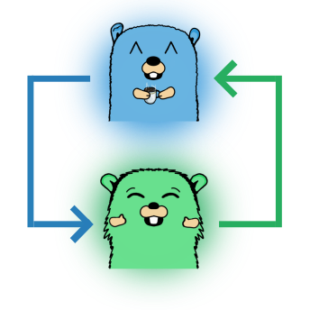

    

<h1 align="center">screego/server</h1>

<i>screen sharing for developers</i>

    
    
    
    

## Intro

Screego was created because of a displeasure against cooperate chatting solutions.
For developers, screen sharing shouldn't be optimized for low bandwidth or presenting some slides.
It should be high definition, that you still can read the tiny font of your colleague.

Screego is an addition to existing software and only helps to share your screen. Nothing else (:.

## Features

* Multi User Screenshare
* Secure transfer via WebRTC
* Low latency / High resolution
* Simple Install via Docker / single binary
* Integrated TURN Server see [NAT Traversal](https://screego.net/#/nat-traversal)

[Demo / Public Instance](https://app.screego.net/) ᛫ [Installation](https://screego.net/#/install) ᛫ [Configuration](https://screego.net/#/config) 

## Versioning

We use [SemVer](http://semver.org/) for versioning. For the versions available, see the
[tags on this repository](https://github.com/screego/server/tags).